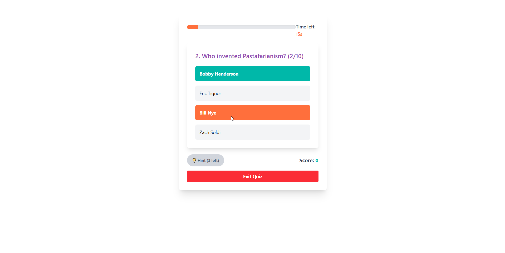
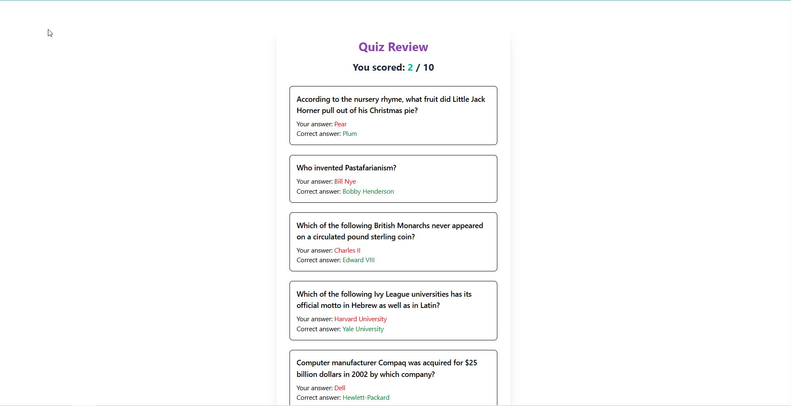

# 🎮 ETL Trivia Game App (Dockerized)

This is a fun, full-stack trivia game that combines **React (Vite)** for the frontend, **FastAPI** for the backend API, and a Python **ETL service** that fetches quiz questions from the Open Trivia DB. The entire app runs in isolated services using **Docker Compose**.

## 🧩 Features

- ✅ Answer selection with highlight
- 💡 Simple hint system
- 📋 Review answers screen
- Fully containerized with Docker (Frontend, Backend, ETL)
- Lightweight and fast — built with Vite + TailwindCSS

## 📦 Tech Stack

- **Frontend:** React + Vite + TailwindCSS
- **Backend:** FastAPI
- **ETL:** Python script with `requests` + `pandas`
- **Docker:** Multi-service container setup using Docker Compose

## 🚀 Getting Started

Make sure you have **Docker** and **Docker Compose** installed.

### 1. Clone the Repository

```bash
git clone https://github.com/yourusername/data-quizzer.git
cd data-quizzer
```

### 2. Build & Start the App

```bash
docker-compose up --build
```

### 3. Shutdown

```bash
docker-compose down --volumes --remove-orphans
```

📂 Project Structure

```bash
.
├── frontend/         # React + Vite UI
├── backend/          # FastAPI server
├── etl/              # Python ETL script
├── docker-compose.yml
└── README.md
```

📷 Screenshots




📝 Article
Read the full breakdown of this project and how Docker makes development & deployment easier:
➡️ [A Comprehensive Guide to Docker: Simplifying Development and Deployment](https://medium.com/@alegeahmadolaitan/a-comprehensive-guide-to-docker-simplifying-development-and-deployment-5ad8d7d1cdca)

🤝 Contributions
Feel free to fork the project or open issues/PRs to improve the game, add questions, or enhance the UI!
